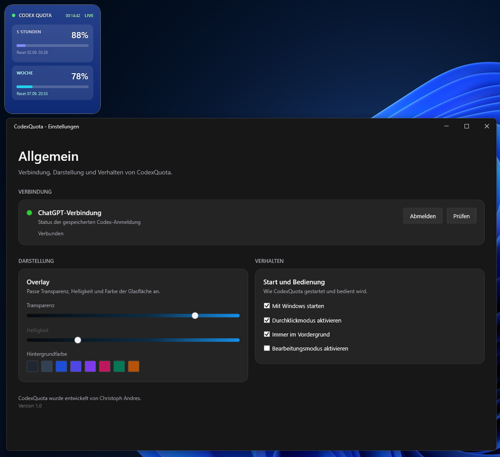

# CodexQuota

Native Windows 11 tray overlay for ChatGPT/Codex quota monitoring.



## Funktionen

- Windows-11-Tray-App ohne eigenes Taskleistenfenster
- Overlay mit getrennten 5-Stunden- und Wochenkontingenten inklusive Reset-Zeit
- Automatische Aktualisierung im 30-Sekunden-Intervall
- Manuelle Anmeldung über ein eingebettetes WebView2-Fenster
- Verschlüsselte lokale Speicherung der Anmeldedaten per Windows DPAPI
- Einstellungen mit Live-Übernahme für Transparenz, Farbe, Vordergrund und Durchklickmodus
- Bearbeitungsmodus mit Verschieben sowie unabhängiger Größenänderung über unsichtbare Außenränder
- Responsive Darstellung für schmale und breite Overlay-Formate

Der verwendete ChatGPT/Codex-Nutzungsendpunkt ist nicht öffentlich dokumentiert und kann sich ändern.

## Build

Voraussetzungen:

- .NET 8 SDK
- Microsoft Edge WebView2 Runtime

Danach im Projektordner ausführen:

```powershell
dotnet restore
dotnet build
```
